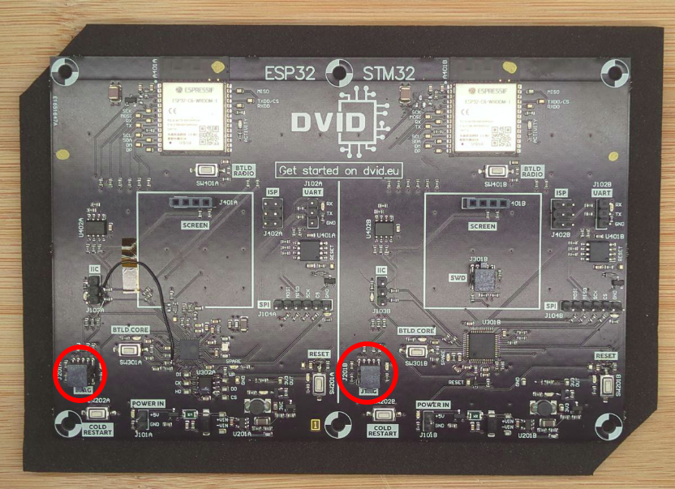
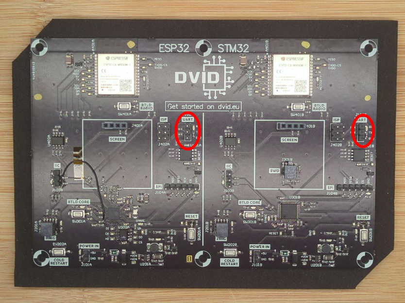
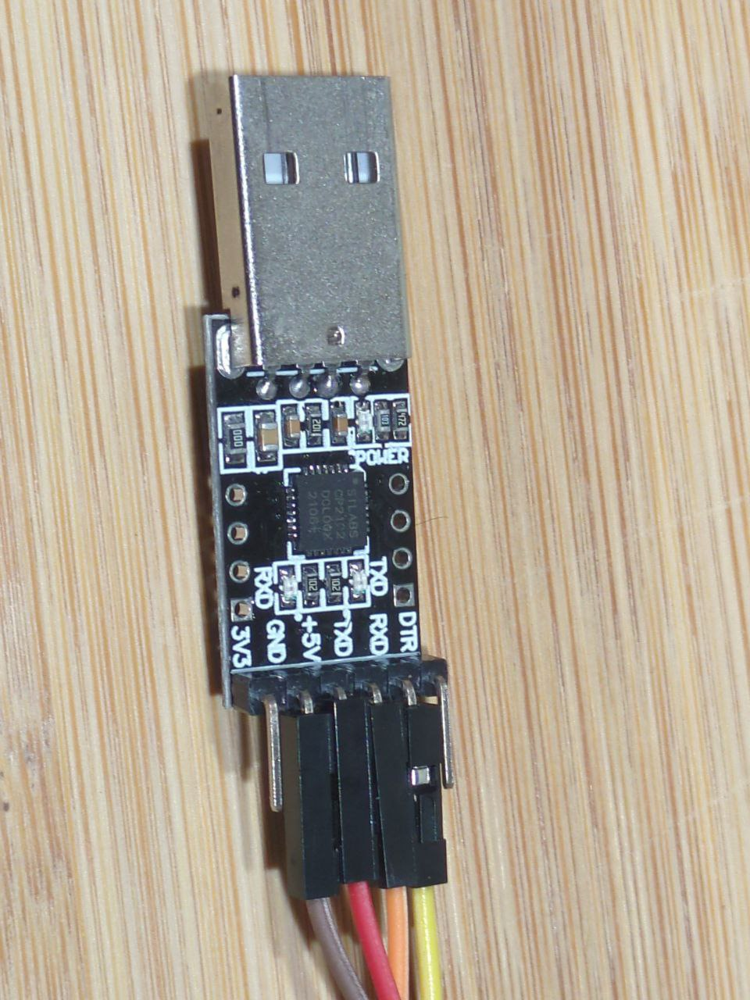
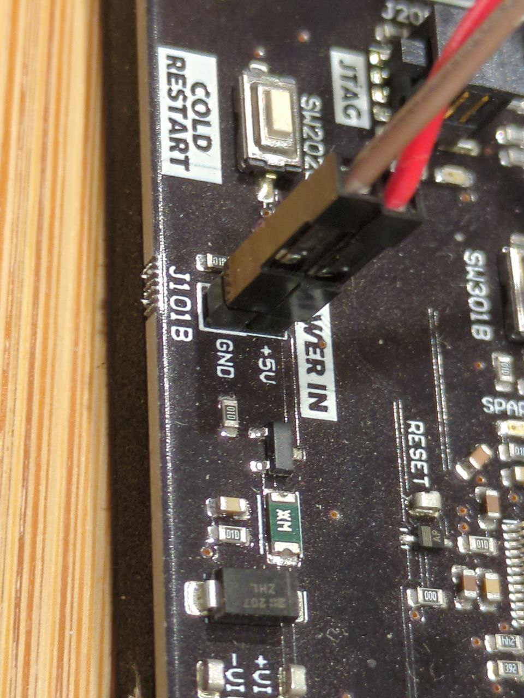
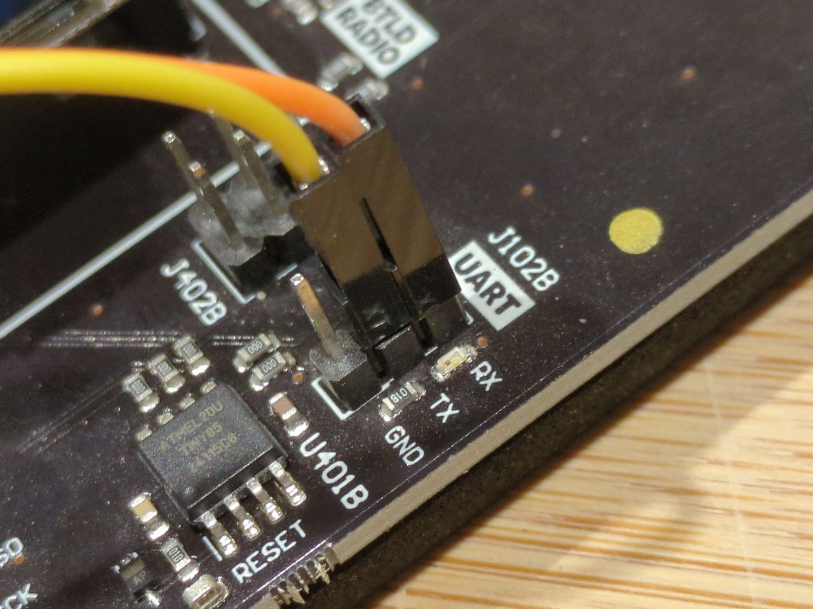

# Discover my DVID board

On the DVID board, you can identify two types of flashing connectors. The first one is JTAG. This method is an advanced way for flashing because it allows direct access to components memory and registers.

The second way to flash the board is using UART port. The board can be set up in a download mode that allows transfer and installation of a firmware.

The next step is to wire the UART dongle correctly to allow information transfer and firmware installation. You can put jumpers on the UART dongle according to the following screenshots. Colors are not important, you just need to have the same on each side of the wire:

* VCC / +5V: power of the board
* GND: power of the board
* RX: receiving UART information on the dongle
* TX: transmitting UART information from the dongle

On the board, you can identify the power, TX and RX port.
The power can be wired according to the following screenshots

* VCC / +5V dongle to +V on the board
* GND dongle to GND on the board

On UART connector, wires need to be crossed. Indeed, UART is only the protocol where wires are crossed. Don't forget this manipulation.

* TX dongle to RX on the board
* RX dongle to TX on the board

