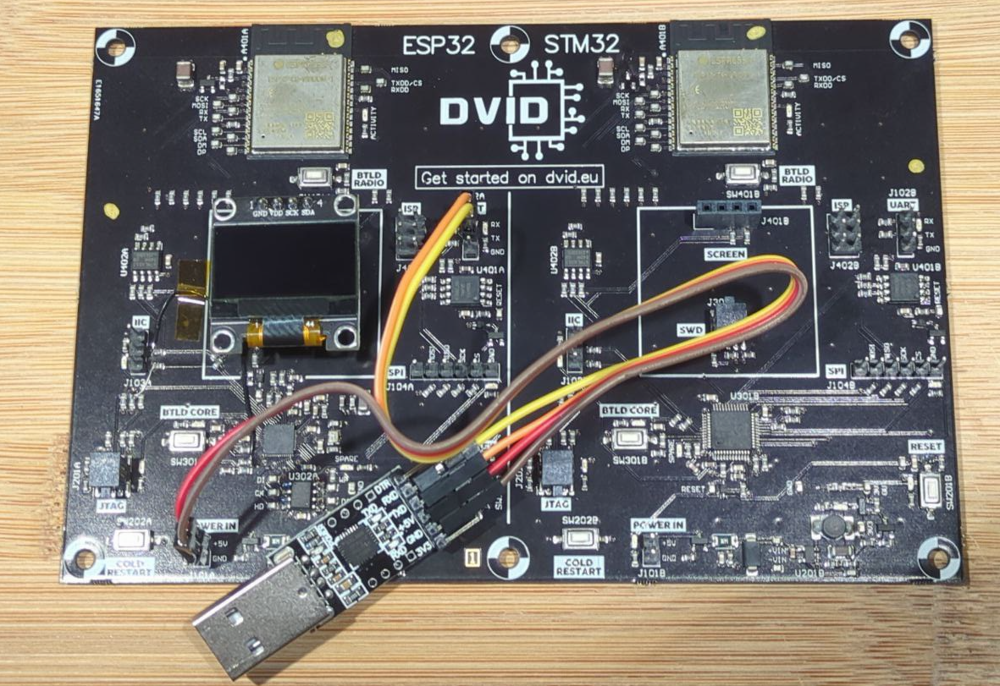
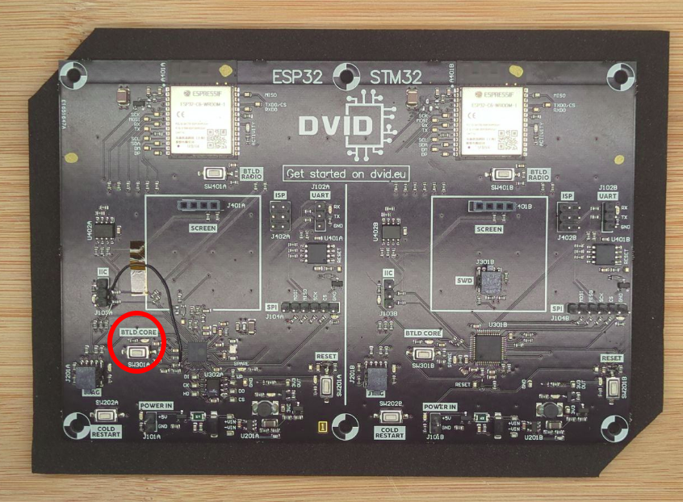
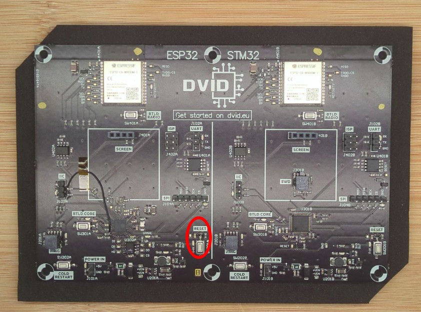

# Flash the ESP32 side of my DVID

## Setup
You need to install the tool `esptool.py`:

```bash
pip install esptool
esptool.py -h
```

## Mapping
Regarding the firmware, following parts are available :

* 0x1000 : bootloader
* 0x8000 : partitions
* 0x10000 : firmware

# Run

In order to flash the firmware, you need to process following steps:
1. Connect the "UART" header of the board to your computer via a USB-UART bridge



2. Power up the board (connect the UART dongle to your computer)

3. Press and hold the "BTLD CORE" button



4. Press, then release the "RESET" button



5. Release the "BTLD CORE" button

6. Execute the flash command

```bash
esptool.py --port /dev/ttyUSB0 --baud 115200 --chip esp32 write_flash 0x10000 ./firmware.esp32
```

Execution trace :
```bash
esptool.py v4.6.2
Serial port /dev/ttyUSB0
Connecting........
Chip is ESP32-D0WD-V3 (revision v3.1)
Features: WiFi, BT, Dual Core, 240MHz, VRef calibration in efuse, Coding Scheme None
Crystal is 40MHz
MAC: 94:54:c5:d8:23:58
Uploading stub...
Running stub...
Stub running...
Configuring flash size...
Flash will be erased from 0x00000000 to 0x003fffff...
Compressed 4194304 bytes to 191559...
Wrote 4194304 bytes (191559 compressed) at 0x00000000 in 29.8 seconds (effective 1124.6 kbit/s)...
Hash of data verified.

Leaving...
Hard resetting via RTS pin...
```

You can now press the reset button to restart the training, something should appear on the screen.

## Recrue

* Bootloader : [ESP32 bootloader.bin](./files/esp32_bootloader.bin)
* Partition : [ESP32 partitions.bin](./files/esp32_partitions.bin)

```bash
esptool.py --port /dev/ttyUSB0 --baud 115200 --chip esp32 write_flash 0x1000 bootloader.bin 0x8000 esp32_parititons.bin 0x10000 ./[FIRMWARE]
```
