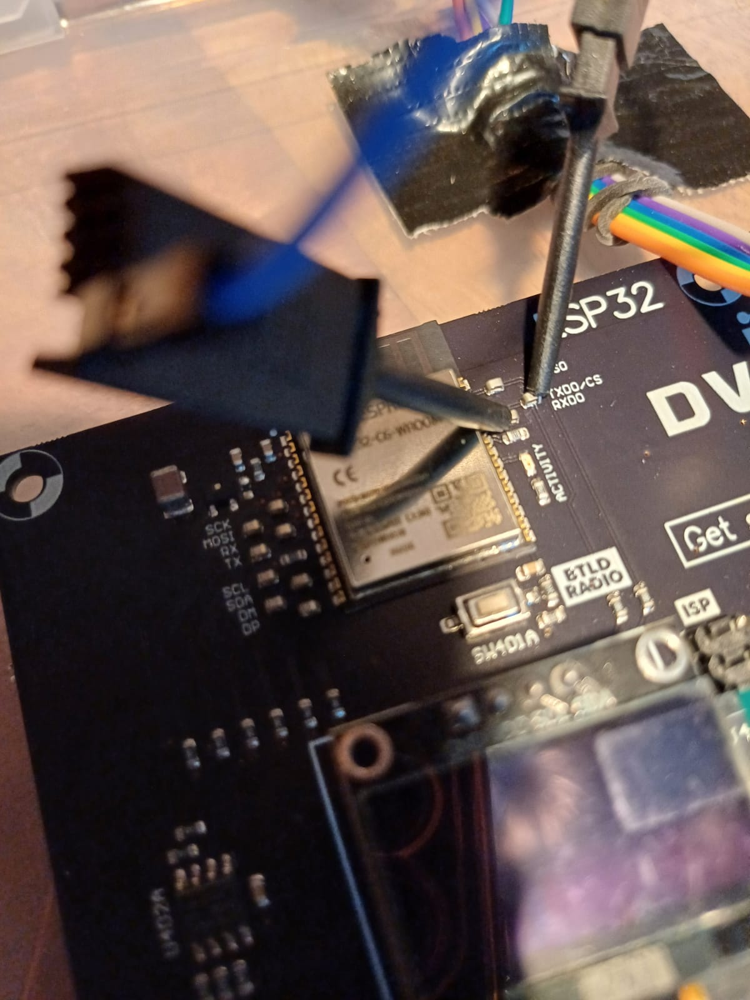

# Flash the ESP32-C6 MCU of my DVID

## Setup
You need to install the tool `esptool.py`:

```bash
pip install esptool
esptool.py -h
```

You need to download those files :

* [espc6_bootloader.bin](./files/espc6_bootloader.bin)

* [espc6_partition-table.bin](./files/espc6_partition-table.bin)

* [espc6_com-at.bin](./files/espc6_com-at.bin)

## Mapping

Regarding the firmware, following parts are available :

* 0x1000 : espc6_bootloader.bin

* 0x8000 : espc6_partition-table.bin

* 0x10000 : espc6_com-at.bin

## Wiring
To flash the ESPC6, you need to wire your UART dongle according the following picture :



# Run

```bash
esptool.py --port /dev/ttyUSB0 --baud 115200 --chip esp32c6 write_flash 0x1000 espc6_bootloader.bin 0x8000 espc6_partition-table.bin 0x10000 espc6_com-at.bin
```
